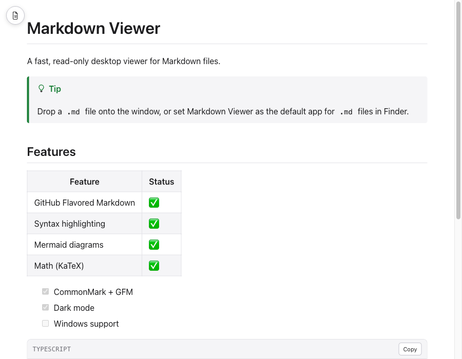
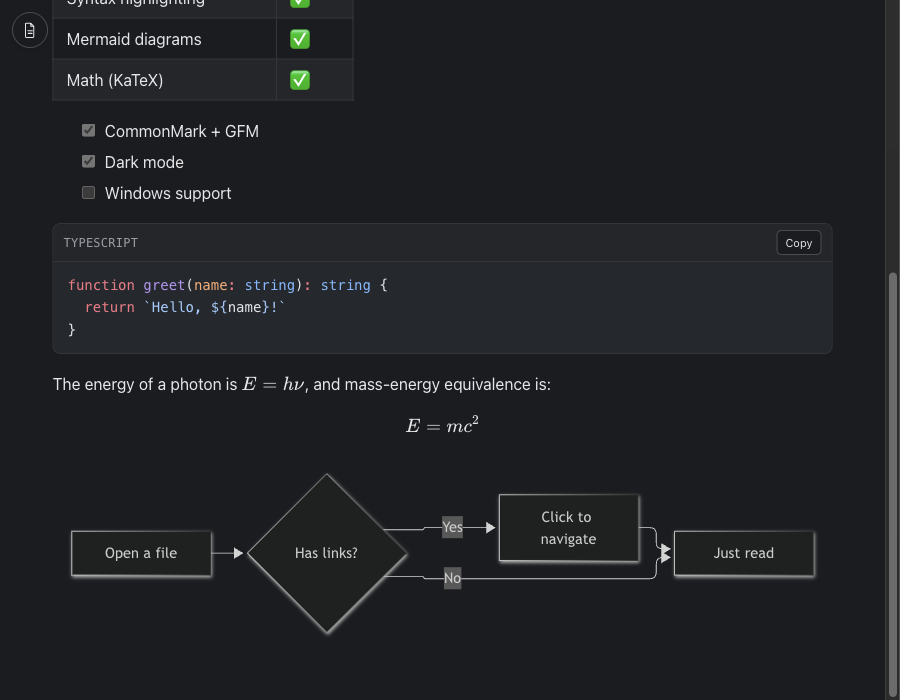

# Markdown Viewer

A lightweight, read-only desktop app for viewing Markdown files. Built with Electron and React — no editing, no note-taking, just a fast, secure viewer. Primary support is macOS, with early Windows builds also available.

<p align="center">
  
  
</p>

## Features

- CommonMark + GitHub Flavored Markdown (tables, task lists, strikethrough, footnotes, autolinks)
- Syntax-highlighted code blocks (Shiki, light/dark aware)
- Mermaid diagrams
- KaTeX math (inline and display)
- GitHub-style Alerts (`> [!NOTE]`, `[!TIP]`, `[!WARNING]`, etc.)
- Full-text search and a table of contents
- Light / Dark / System theme, with support for custom CSS
- Navigates between linked Markdown files in the same window, with back/forward history
- Watches the open file and reloads automatically when it changes on disk
- Sandboxed, security-hardened Electron setup — no Node.js access in the renderer, strict Content-Security-Policy, no `file://` loading

## Installation

### macOS

Download the latest `.dmg` from [Releases](https://github.com/TakadaJohn-sub/markdown-viewer/releases), open it, and drag **Markdown Viewer** into Applications.

This build isn't code-signed yet, so on first launch macOS will say it "cannot be opened because Apple cannot check it for malicious software." To open it anyway:

1. Right-click (Control-click) **Markdown Viewer** in Applications and choose **Open**.
2. Confirm **Open** in the dialog that appears.

You only need to do this once — after that it opens normally.

### Windows (early support)

Download `Markdown Viewer-*-win.zip` (x64) or `Markdown Viewer-*-arm64-win.zip` (ARM64) from [Releases](https://github.com/TakadaJohn-sub/markdown-viewer/releases), extract it, and run `Markdown Viewer.exe` directly — there's no installer yet. This build is cross-compiled from macOS; basic functionality has been confirmed working, but it doesn't have the same automated test coverage as macOS. Please [open an issue](https://github.com/TakadaJohn-sub/markdown-viewer/issues) if you hit problems.

## Development

```bash
npm install
npm run dev
```

### Testing

```bash
npm run test       # unit tests (Vitest)
npm run test:e2e   # end-to-end tests (Playwright)
npm run typecheck
npm run lint
```

### Building

```bash
npm run package             # unpacked macOS build, for local testing
npm run dist                 # signed-locally macOS dmg + zip, for distribution
npx electron-builder --win --x64 --arm64   # Windows zip (cross-compiled, no installer yet)
```

## Known limitations

- Unsigned build — see Installation above. Proper Apple notarization is planned for a future release.
- Windows support is early: cross-compiled, no installer yet, and not covered by the automated test suite (which runs on macOS).
- Read-only by design — this is a viewer, not an editor.

## License

[MIT](./LICENSE)
