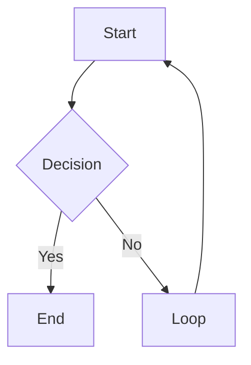

# Phase 2 Preview

> [!NOTE]
> This is a note alert.

> [!WARNING]
> This is a warning alert.

Inline math $E=mc^2$ and a price $5 or $10 (should stay plain).

$$
\int_0^1 x^2\,dx = \frac{1}{3}
$$

Broken math: $\frac{1}$
